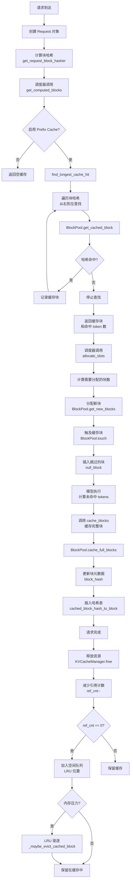

# Prefix Caching

## 概述

Prefix Caching（前缀缓存）是 vLLM 中用于优化推理性能的关键特性,它通过缓存和复用已计算的 KV cache 来显著降低 Time To First Token (TTFT) 和提升整体吞吐量。该特性特别适用于多轮对话、RAG 场景、以及具有重复前缀的批处理请求。

### 核心功能

**自动缓存复用**: Prefix Caching 自动识别请求之间的共同前缀,并将已计算的 KV cache 块存储在 GPU 内存中。当新请求到来时,系统会自动查找最长的缓存命中前缀,避免重复计算。

**基于块的哈希索引**: 系统将输入序列切分为固定大小的块(通常为 16-256 个 token),每个块通过密码学哈希算法(SHA256/xxhash)生成唯一标识。哈希值包含父块哈希、当前块 token IDs 以及额外上下文信息(如 LoRA、多模态输入),确保缓存的正确性和安全性。

**多注意力类型支持**: Prefix Caching 支持多种注意力机制,包括:
- Full Attention: 标准的全注意力机制
- Sliding Window Attention: 滑动窗口注意力,自动处理窗口外块的替换
- Chunked Local Attention: 分块局部注意力
- MLA (Multi-Head Latent Attention): 多头潜在注意力
- Mamba: 状态空间模型
- Cross Attention: 交叉注意力(不支持缓存共享)

**LRU 淘汰策略**: 当 GPU 内存不足时,系统采用最近最少使用(LRU)策略自动淘汰缓存块。每个块维护引用计数,支持多个请求共享同一块缓存数据。

**混合模型支持**: 对于包含多种注意力类型的混合模型(如 Gemma3),Prefix Caching 采用迭代算法找到所有类型都能接受的最长公共前缀,确保缓存的一致性。

### 性能优势

在典型工作负载中,Prefix Caching 可以实现:
- **3-10x TTFT 降低**: 对于包含共同前缀的多轮对话或批量请求
- **2-5x 吞吐量提升**: 通过减少重复计算提高 GPU 利用率
- **内存效率**: 块级共享和引用计数避免数据冗余

## 架构设计

Prefix Caching 在 vLLM v1 引擎中的架构位置如下:

```
┌─────────────────────────────────────────────────────────────┐
│                    Scheduler / Engine Core                   │
│  ┌──────────────────────────────────────────────────────┐   │
│  │           KVCacheManager                              │   │
│  │  - get_computed_blocks(request)                       │   │
│  │  - allocate_slots(...)                                │   │
│  │  - free(request_id)                                   │   │
│  └───────────────────────┬──────────────────────────────┘   │
│                         │                                    │
│  ┌──────────────────────▼──────────────────────────────┐   │
│  │      KVCacheCoordinator                              │   │
│  │  ┌─────────────┐  ┌──────────────┐                  │   │
│  │  │ Unitary     │  │ Hybrid       │                  │   │
│  │  │ Coordinator │  │ Coordinator  │                  │   │
│  │  └──────┬──────┘  └──────┬───────┘                  │   │
│  │         │                │                            │   │
│  │  ┌──────▼────────────────▼─────────┐                │   │
│  │  │  SingleTypeKVCacheManager[]    │                │   │
│  │  │  - FullAttentionManager        │                │   │
│  │  │  - SlidingWindowManager        │                │   │
│  │  │  - ChunkedLocalAttentionManager│                │   │
│  │  │  - MambaManager                │                │   │
│  │  └──────┬─────────────────────────┘                │   │
│  └─────────┼──────────────────────────────────────────┘   │
│            │                                                │
│  ┌─────────▼──────────────────────────────────────────┐   │
│  │          BlockPool                                 │   │
│  │  - blocks[]: 所有 KV cache 块                      │   │
│  │  - free_block_queue: LRU 空闲块队列                │   │
│  │  - cached_block_hash_to_block: 哈希到块的映射       │   │
│  │  - null_block: 特殊占位块                          │   │
│  └────────────────────────────────────────────────────┘   │
└─────────────────────────────────────────────────────────────┘
```

### 核心模块

#### 1. KVCacheManager (`vllm/v1/core/kv_cache_manager.py`)

**主要功能**: 作为调度器和 KV cache 系统之间的主接口,隐藏内部数据结构复杂性。

**对外接口**:
```python
class KVCacheManager:
    def __init__(
        self,
        kv_cache_config: KVCacheConfig,
        max_model_len: int,
        hash_block_size: int,
        enable_caching: bool = True,
        use_eagle: bool = False,
        log_stats: bool = False,
        ...
    )

    def get_computed_blocks(
        self, request: Request
    ) -> tuple[KVCacheBlocks, int]:
        """获取请求的缓存块
        Returns:
            (cached_blocks, num_computed_tokens)
        """

    def allocate_slots(
        self,
        request_id: str,
        num_tokens: int,
        computed_blocks: KVCacheBlocks,
        num_computed_tokens: int,
        ...
    ) -> KVCacheBlocks:
        """为请求分配 KV cache 插槽"""

    def free(self, request_id: str) -> None:
        """释放请求的所有块"""

    @property
    def usage(self) -> float:
        """返回 KV cache 使用率 (0.0-1.0)"""
```

#### 2. KVCacheCoordinator (`vllm/v1/core/kv_cache_coordinator.py`)

**主要功能**: 协调多个 KV cache 组(支持混合注意力模型)。

**实现类型**:
- **UnitaryKVCacheCoordinator**: 单一 KV cache 组(最常见)
- **HybridKVCacheCoordinator**: 多个 KV cache 组(混合注意力模型)
- **KVCacheCoordinatorNoPrefixCache**: 禁用 Prefix Caching

**对外接口**:
```python
class KVCacheCoordinator(ABC):
    def find_longest_cache_hit(
        self,
        block_hashes: list[BlockHash],
        max_cache_hit_length: int,
    ) -> tuple[tuple[list[KVCacheBlock], ...], int]:
        """查找最长缓存命中前缀
        Args:
            block_hashes: 请求的块哈希列表
            max_cache_hit_length: 最大命中长度
        Returns:
            (cached_blocks_for_each_group, num_hit_tokens)
        """

    def allocate_new_computed_blocks(...) -> None:
        """分配并触及缓存命中块"""

    def cache_blocks(request: Request, num_computed_tokens: int) -> None:
        """缓存完整的块"""

    def free(request_id: str) -> None:
        """释放请求的所有块"""
```

#### 3. SingleTypeKVCacheManager (`vllm/v1/core/single_type_kv_cache_manager.py`)

**主要功能**: 管理特定注意力类型的 KV cache 逻辑。

**实现类型**:
- **FullAttentionManager**: 全注意力,支持任意前缀缓存
- **SlidingWindowManager**: 滑动窗口,自动处理窗口外块
- **ChunkedLocalAttentionManager**: 分块局部注意力
- **MambaManager**: Mamba 状态空间模型
- **CrossAttentionManager**: 交叉注意力(不支持缓存共享)

**核心方法**:
```python
class SingleTypeKVCacheManager(ABC):
    @classmethod
    def find_longest_cache_hit(
        cls,
        block_hashes: BlockHashList,
        max_length: int,
        kv_cache_group_ids: list[int],
        block_pool: BlockPool,
        kv_cache_spec: KVCacheSpec,
        use_eagle: bool,
        alignment_tokens: int,
        ...
    ) -> tuple[list[KVCacheBlock], ...]:
        """查找最长缓存命中前缀(特定注意力类型)"""

    def allocate_new_computed_blocks(...) -> None:
        """分配新的计算块,包括:
        1. 触及(prefix cache hit)的块
        2. 外部计算块(来自 KV connector)
        3. 跳过的块(null blocks)
        """

    def cache_blocks(request: Request, num_tokens: int) -> None:
        """缓存完整的块到 prefix cache"""

    def free(request_id: str) -> None:
        """释放块的顺序很重要,从尾部开始释放"""
```

#### 4. BlockPool (`vllm/v1/core/block_pool.py`)

**主要功能**: 管理 KV cache 的物理内存块,维护 prefix cache 索引。

**数据结构**:
```python
class BlockPool:
    blocks: list[KVCacheBlock]  # 所有可用块
    free_block_queue: FreeKVCacheBlockQueue  # LRU 空闲块队列
    cached_block_hash_to_block: BlockHashToBlockMap  # 哈希索引
    null_block: KVCacheBlock  # 特殊占位块

    class KVCacheBlock:
        block_id: int
        ref_cnt: int  # 引用计数
        block_hash: BlockHashWithGroupId | None  # 缓存哈希
        is_null: bool  # 是否为占位块
```

**对外接口**:
```python
class BlockPool:
    def get_cached_block(
        self,
        block_hash: BlockHash,
        kv_cache_group_ids: list[int],
    ) -> list[KVCacheBlock] | None:
        """根据哈希获取缓存的块(支持多组)"""

    def cache_full_blocks(
        self,
        request: Request,
        blocks: list[KVCacheBlock],
        num_cached_blocks: int,
        num_full_blocks: int,
        block_size: int,
        kv_cache_group_id: int,
    ) -> None:
        """更新块的哈希元数据并缓存到哈希表"""

    def get_new_blocks(self, num_blocks: int) -> list[KVCacheBlock]:
        """从空闲队列获取新块,自动驱逐缓存块"""

    def free_blocks(self, blocks: Iterable[KVCacheBlock]) -> None:
        """释放块,减少引用计数,ref_cnt=0 时加入空闲队列"""

    def touch(self, blocks: Sequence[KVCacheBlock]) -> None:
        """增加块的引用计数,防止被驱逐"""

    def reset_prefix_cache(self) -> bool:
        """清空所有缓存(用于 RLHF/benchmarking)"""
```

#### 5. KVCacheUtils (`vllm/v1/core/kv_cache_utils.py`)

**主要功能**: 提供块哈希计算和工具函数。

**核心类型**:
```python
BlockHash = NewType("BlockHash", bytes)  # 单个块的哈希
BlockHashWithGroupId = NewType("BlockHashWithGroupId", bytes)  # 带 KV cache 组 ID
BlockHashList = list[BlockHash]  # 块哈希列表
```

**哈希函数**:
```python
def hash_block_tokens(
    hash_function: Callable[[Any], bytes],
    parent_block_hash: BlockHash | None,
    curr_block_token_ids: Sequence[int],
    extra_keys: tuple[Any, ...] | None = None,
) -> BlockHash:
    """计算单个块的哈希值
    Args:
        parent_block_hash: 父块哈希(用于链式哈希)
        curr_block_token_ids: 当前块的 token IDs
        extra_keys: 额外上下文(LoRA、多模态等)
    Returns:
        块哈希值
    """

def get_request_block_hasher(
    block_size: int,
    caching_hash_fn: Callable[[Any], bytes],
) -> Callable[[Request], list[BlockHash]]:
    """返回请求的块哈希计算函数
    - 只计算完整块
    - 处理多模态输入和 LoRA
    - 支持增量计算(只计算新完成的块)
    """
```

**特殊块**:
- **NONE_HASH**: 根块的随机种子哈希
- **null_block**: 永不缓存的占位块(用于滑动窗口跳过的块)

## 主要流程

Prefix Caching 的完整生命周期流程如下:



### 详细流程步骤

#### 阶段 1: 请求初始化和哈希计算

```
1. 用户请求到达 → 创建 Request 对象
   ↓
2. get_request_block_hasher() 生成初始块哈希
   - 将 prompt tokens 按 block_size 分块
   - 计算每个完整块的哈希: hash(parent_hash, block_tokens, extra_keys)
   - extra_keys 包括: LoRA ID、多模态输入、cache_salt
   ↓
3. Request.block_hashes 存储初始哈希列表
   - 例如: [hash0, hash1, hash2] (假设有 3 个完整块)
```

#### 阶段 2: 缓存命中检测

```
4. Scheduler 调用 KVCacheManager.get_computed_blocks(request)
   ↓
5. KVCacheCoordinator.find_longest_cache_hit(block_hashes, max_length)
   ↓
6. 对于单一 KV cache 组 (UnitaryKVCacheCoordinator):
   - 直接调用 SingleTypeKVCacheManager.find_longest_cache_hit
   ↓
7. 对于混合 KV cache 组 (HybridKVCacheCoordinator):
   - 使用迭代固定点算法
   - 对每种注意力类型查找缓存命中
   - 取所有类型的最小公共长度
   ↓
8. FullAttentionManager.find_longest_cache_hit 实现:
   从右到左遍历块哈希:
   for i in range(max_num_blocks - 1, -1, -1):
       if cached_block := block_pool.get_cached_block(block_hashes[i]):
           hit_blocks.append(cached_block)
       else:
           break  # 停止查找
   ↓
9. 返回 (hit_blocks, num_hit_tokens)
   - hit_blocks: KVCacheBlock[] 数组
   - num_hit_tokens = len(hit_blocks) * block_size
```

#### 阶段 3: 块分配

```
10. Scheduler 调用 KVCacheManager.allocate_slots()
    ↓
11. KVCacheCoordinator.get_num_blocks_to_allocate()
    - 考虑已缓存的块
    - 考虑跳过的块(滑动窗口)
    - 考虑外部计算块(KV connector)
    ↓
12. KVCacheCoordinator.allocate_new_computed_blocks()
    - BlockPool.touch(hit_blocks): 增加引用计数
    - 插入跳过的块: [null_block, null_block, ...]
    - 分配外部计算块: BlockPool.get_new_blocks()
    ↓
13. BlockPool.get_new_blocks(num_blocks):
    - 从 free_block_queue 弹出块
    - 如果块有 block_hash,自动驱逐
    - 增加 ref_cnt
    ↓
14. 返回 KVCacheBlocks 给 Scheduler
    - 包含: [null_block, ..., cached_block1, cached_block2, ..., new_block1, ...]
```

#### 阶段 4: 模型执行

```
15. Scheduler 执行模型前向传播
    - 使用分配的 KV cache 块
    - 只计算未命中的 tokens
    - 新计算的 KV 写入新分配的块
    ↓
16. 当块被填满时 (token_count % block_size == 0):
    - 请求生成新的块哈希: request.get_hash_new_full_blocks()
    - 扩展 request.block_hashes 列表
```

#### 阶段 5: 缓存更新

```
17. Scheduler 调用 KVCacheManager.cache_blocks(request, num_tokens)
    ↓
18. SingleTypeKVCacheManager.cache_blocks()
    - num_full_blocks = num_tokens // block_size
    - num_cached_blocks = self.num_cached_block[request_id]
    - 只缓存新完成的块
    ↓
19. BlockPool.cache_full_blocks():
    for i, blk in enumerate(new_full_blocks):
        if blk.is_null: continue  # 跳过 null blocks
        block_hash = request.block_hashes[i]
        block_hash_with_group_id = make_block_hash_with_group_id(
            block_hash, kv_cache_group_id
        )
        blk.block_hash = block_hash_with_group_id
        self.cached_block_hash_to_block.insert(block_hash_with_group_id, blk)
    ↓
20. 更新 self.num_cached_block[request_id] = num_full_blocks
```

#### 阶段 6: 请求完成和释放

```
21. 请求完成 → KVCacheManager.free(request_id)
    ↓
22. SingleTypeKVCacheManager.free():
    - 获取请求的所有块: req_to_blocks[request_id]
    - **反向**释放: reversed(req_blocks)
    - BlockPool.free_blocks(blocks_reversed)
    ↓
23. BlockPool.free_blocks():
    for block in blocks:
        block.ref_cnt -= 1
        if block.ref_cnt == 0:
            free_block_queue.append(block)
            # 块进入 LRU 队列尾部
            # 如果 block_hash 存在,保留在哈希表中
    ↓
24. 清理请求数据:
    - del req_to_blocks[request_id]
    - del num_cached_block[request_id]
```

#### 阶段 7: LRU 驱逐

```
25. 当需要新块但空闲队列不足时:
    BlockPool.get_new_blocks() 调用 _maybe_evict_cached_block()
    ↓
26. _maybe_evict_cached_block(block):
    if block.block_hash is not None:
        # 从哈希表移除
        self.cached_block_hash_to_block.remove(block.block_hash, block)
        block.reset_hash()
        return True  # 已驱逐
    ↓
27. 块被分配给新请求
    - ref_cnt 设置为 1
    - 如果原缓存有多个引用,其他请求仍可使用
```

### 特殊场景

#### 滑动窗口注意力

```
SlidingWindowManager.find_longest_cache_hit():
  滑动窗口大小 = 8, block_size = 4
  Tokens:    [0  1  2  3 | 4  5  6  7 | 8  9 10 11 | 12 13 14 15]
  Blocks:     [----blk0----|----blk1----|----blk2----|----blk3----]
  当 num_computed_tokens = 16:
  - 窗口覆盖 tokens 9-15
  - tokens 0-7 在窗口外,应跳过
  - 返回: [null_block, null_block, cached_blk2, cached_blk3]
  - num_skipped_tokens = 9
```

#### 混合注意力模型

```
HybridKVCacheCoordinator.find_longest_cache_hit():
  模型有 2 种注意力类型:
  - Layers 0-20: Full Attention (block_size=16)
  - Layers 21-40: Sliding Window (block_size=16)

  迭代固定点算法:
  1. initial_length = 15
  2. Full Attention.find_longest_cache_hit() → 12 tokens (命中 3 个块)
  3. SlidingWindow.find_longest_cache_hit(max=12) → 8 tokens (窗口限制)
  4. 重复直到收敛
  最终返回: length = 8, blocks = [...]
```

## 相关代码

### 核心文件列表

| 文件路径 | 行数估算 | 主要内容 |
|---------|---------|---------|
| `vllm/v1/core/kv_cache_manager.py` | ~300 | KVCacheManager 主接口 |
| `vllm/v1/core/kv_cache_coordinator.py` | ~600 | KVCacheCoordinator 及子类 |
| `vllm/v1/core/single_type_kv_cache_manager.py` | ~900 | 各种注意力类型的管理器 |
| `vllm/v1/core/block_pool.py` | ~500 | BlockPool 和 KVCacheBlock |
| `vllm/v1/core/kv_cache_utils.py` | ~800 | 块哈希计算和工具函数 |
| `vllm/v1/kv_cache_interface.py` | ~400 | KVCacheConfig 和规格定义 |
| `vllm/config/cache.py` | ~200 | CacheConfig 配置类 |
| `vllm/v1/request.py` | ~300 | Request 类(包含 block_hashes) |

### 关键数据结构

```python
# vllm/v1/core/kv_cache_utils.py
@dataclass
class KVCacheBlock:
    block_id: int                           # 块 ID (0 到 num_gpu_blocks-1)
    ref_cnt: int = 0                        # 引用计数
    _block_hash: BlockHashWithGroupId | None  # 缓存哈希
    prev_free_block: "KVCacheBlock | None"  # LRU 链表前驱
    next_free_block: "KVCacheBlock | None"  # LRU 链表后继
    is_null: bool = False                   # 是否为占位块

# vllm/v1/core/kv_cache_manager.py
@dataclass
class KVCacheBlocks:
    blocks: tuple[Sequence[KVCacheBlock], ...]  # [group0_blocks, group1_blocks, ...]
    # blocks[i][j] = 第 i 个 KV cache 组的第 j 个块
```

### 关键函数索引

| 函数名 | 文件 | 行号 | 功能 |
|--------|------|------|------|
| `get_computed_blocks()` | `kv_cache_manager.py` | ~164 | 获取缓存命中块 |
| `find_longest_cache_hit()` | `single_type_kv_cache_manager.py` | ~393 | 查找最长前缀(Full Attention) |
| `find_longest_cache_hit()` | `single_type_kv_cache_manager.py` | ~463 | 查找最长前缀(Sliding Window) |
| `hash_block_tokens()` | `kv_cache_utils.py` | ~525 | 计算块哈希 |
| `get_request_block_hasher()` | `kv_cache_utils.py` | ~555 | 生成请求哈希函数 |
| `cache_full_blocks()` | `block_pool.py` | ~209 | 缓存完整块 |
| `get_cached_block()` | `block_pool.py` | ~187 | 根据哈希获取缓存块 |
| `get_new_blocks()` | `block_pool.py` | ~299 | 分配新块 |
| `free_blocks()` | `block_pool.py` | ~367 | 释放块 |
| `touch()` | `block_pool.py` | ~381 | 增加引用计数 |
| `_maybe_evict_cached_block()` | `block_pool.py` | ~331 | 驱逐缓存块 |

## 使用说明

### 基本配置

Prefix Caching 在 vLLM 中默认启用。基本用法:

```python
from vllm import LLM, SamplingParams

# 创建 LLM 实例(Prefix Caching 默认启用)
llm = LLM(
    model="meta-llama/Llama-2-7b-chat-hf",
    enable_prefix_caching=True,  # 显式启用(默认为 True)
)

# 第一次请求 - 计算 KV cache
outputs = llm.generate(["Explain quantum computing in simple terms."],
                       SamplingParams(max_tokens=100))

# 第二次请求 - 自动复用前缀缓存(如果有共同前缀)
outputs = llm.generate(["Explain quantum computing in detail."],
                       SamplingParams(max_tokens=100))
```

### 高级配置选项

```python
from vllm import LLM
from vllm.config import CacheConfig

# 自定义缓存配置
cache_config = CacheConfig(
    enable_prefix_caching=True,
    prefix_caching_hash_algo="sha256",  # 哈希算法: "sha256" | "sha256_cbor" | "xxhash" | "xxhash_cbor"
    block_size=16,                      # 块大小( tokens)
    gpu_memory_utilization=0.9,         # GPU 内存利用率
)

llm = LLM(
    model="meta-llama/Llama-2-7b-chat-hf",
    cache_config=cache_config,
)
```

### 哈希算法选择

| 算法 | 安全性 | 性能 | 跨语言 | 适用场景 |
|------|--------|------|--------|----------|
| `sha256` | 高 | 中 | 否 | 默认,最高安全性 |
| `sha256_cbor` | 高 | 中 | 是 | 需要跨语言复用缓存 |
| `xxhash` | 中 | 高 | 否 | 性能优先,低风险环境 |
| `xxhash_cbor` | 中 | 高 | 是 | 性能+跨语言需求 |

**注意**: 在多租户环境中使用非加密哈希(xxhash)可能导致哈希碰撞风险。

### 禁用 Prefix Caching

```python
# 方法 1: 创建时禁用
llm = LLM(
    model="meta-llama/Llama-2-7b-chat-hf",
    enable_prefix_caching=False,
)

# 方法 2: 运行时重置缓存(用于 RLHF 或 benchmarking)
llm.llm_engine.reset_prefix_cache()
```

### 监控和统计

```python
# 启用统计日志
llm = LLM(
    model="meta-llama/Llama-2-7b-chat-hf",
    enable_prefix_caching=True,
    log_stats=True,  # 启用统计收集
)

# 执行推理...
outputs = llm.generate(...)

# 获取 Prefix Cache 统计
stats = llm.llm_engine.get_prefix_cache_stats()
print(f"Cache hit rate: {stats.cache_hit_rate:.2%}")
print(f"Total tokens: {stats.total_tokens}")
print(f"Cached tokens: {stats.cached_tokens}")
```

### 使用 OpenAI API

```bash
# 启动服务器(默认启用 Prefix Caching)
vllm serve meta-llama/Llama-2-7b-chat-hf \
    --enable-prefix-caching \
    --prefix-caching-hash-algo sha256

# 或通过配置文件
vllm serve meta-llama/Llama-2-7b-chat-hf \
    --config config.json
```

### 环境变量

```bash
# 设置 CBOR 哈希的随机种子(用于可重现性)
export PYTHONHASHSEED=0

# 启用 KV cache 事件(用于调试/监控)
export VLLM_KV_CACHE_EVENTS=1

# 使用整数块哈希(兼容性)
export VLLM_KV_EVENTS_USE_INT_BLOCK_HASHES=1
```

### 最佳实践

1. **块大小选择**:
   - 小块(16): 更细粒度缓存,但内存开销大
   - 大块(256): 内存效率高,但缓存命中率可能降低
   - 推荐: 16-32,根据典型请求长度调整

2. **多轮对话**:
   - 保持相同的 system prompt 以最大化缓存复用
   - 使用 `cache_salt` 区分不同会话

3. **RAG 应用**:
   - 缓存常见文档的 KV cache
   - 考虑使用 LMCache 进行持久化跨实例缓存

4. **LoRA 模型**:
   - 块哈希自动包含 LoRA ID
   - 不同 LoRA 适配器的缓存不会冲突

5. **内存管理**:
   - 监控 `KVCacheManager.usage` 避免内存溢出
   - 考虑使用 `cpu_offload_gb` 扩展缓存容量

### 限制和注意事项

1. **部分块不支持缓存**:
   - 只有完整的块(block_size 个 tokens)才会被缓存
   - 最后一个不完整的块不会被缓存

2. **多模态输入**:
   - 图像/音频输入会影响块哈希
   - 仅当多模态特征完全相同时才能命中缓存

3. **Cross Attention**:
   - 编码器-解码器注意力不支持缓存共享
   - 每个请求单独分配 cross-attention 块

4. **EAGLE 投机解码**:
   - 启用 EAGLE 时会丢弃最后一个缓存块
   - 确保最后一个块被重新计算以获取 drafting head 的隐藏状态

5. **分布式推理**:
   - Context Parallel (DCP/PCP) 会增加块大小
   - 确保所有进程使用相同的 `hash_block_size`

### 故障排查

```python
# 检查缓存状态
print(f"KV cache usage: {llm.llm_engine.get_cache_usage():.2%}")

# 获取详细统计
stats = llm.llm_engine.get_prefix_cache_stats()
if stats:
    print(f"Cache hits: {stats.num_cache_hits}")
    print(f"Cache misses: {stats.num_cache_misses}")

# 重置缓存(如果出现异常)
llm.llm_engine.reset_prefix_cache()
```

### 与 LMCache 集成

对于需要跨实例持久化缓存的高级场景,考虑使用 LMCache:

```bash
pip install lmcache

# LMCache 自动集成 vLLM 的 prefix caching
# 提供 CPU/Disk/Remote 存储后端
python -m lmcache.server --backend redis
```

LMCache 扩展了 vLLM 的 prefix caching 能力,支持:
- 跨实例缓存共享
- 持久化存储(NVMe/Redis/S3)
- 分离式 Prefill-Decode 架构
- 3-10x TTFT 降低(相比本地 prefix caching)
