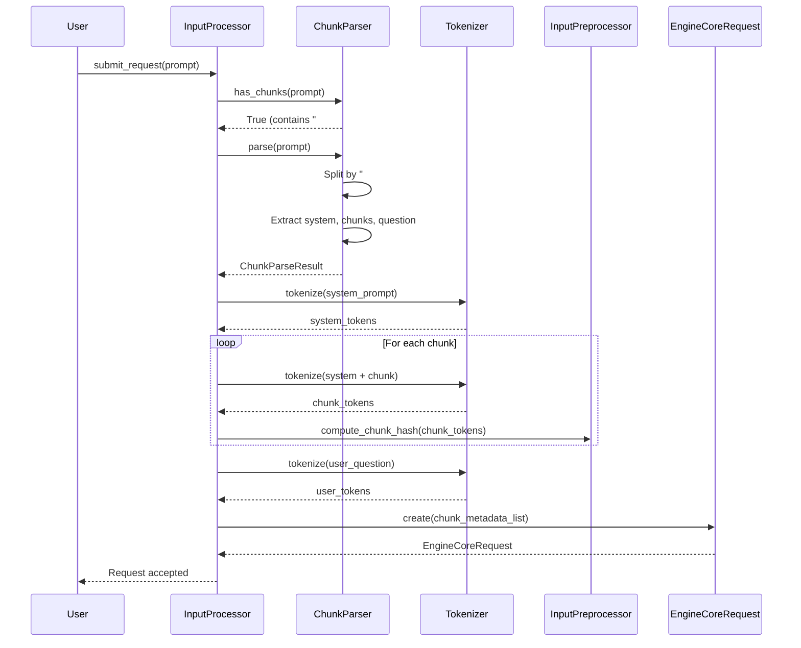
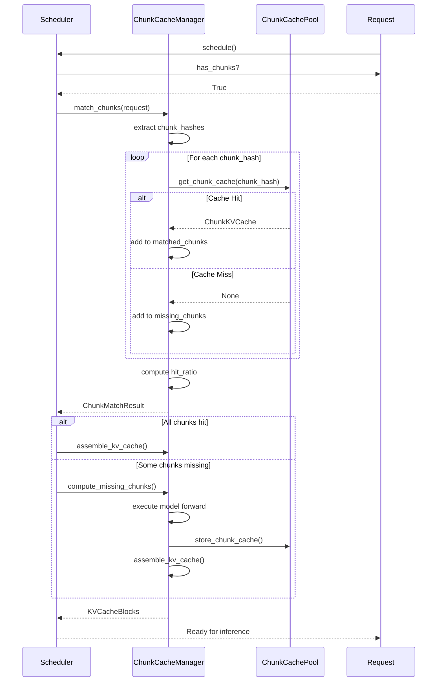
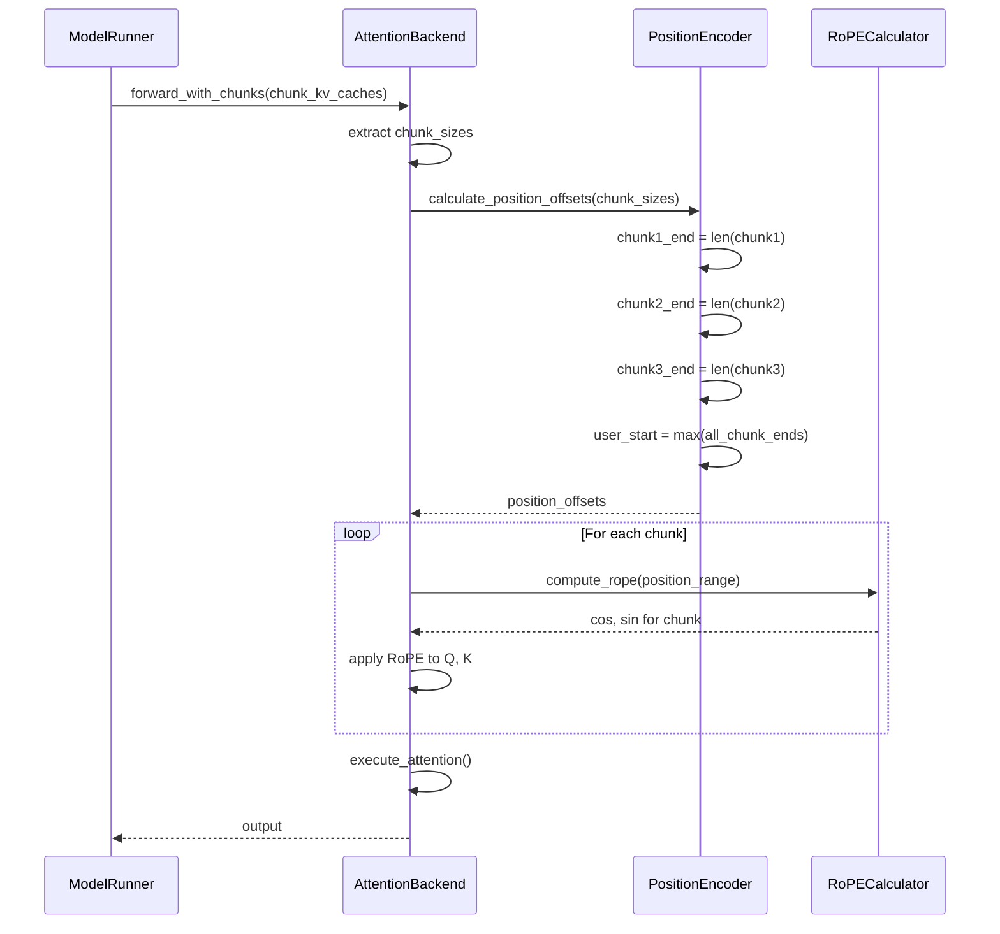
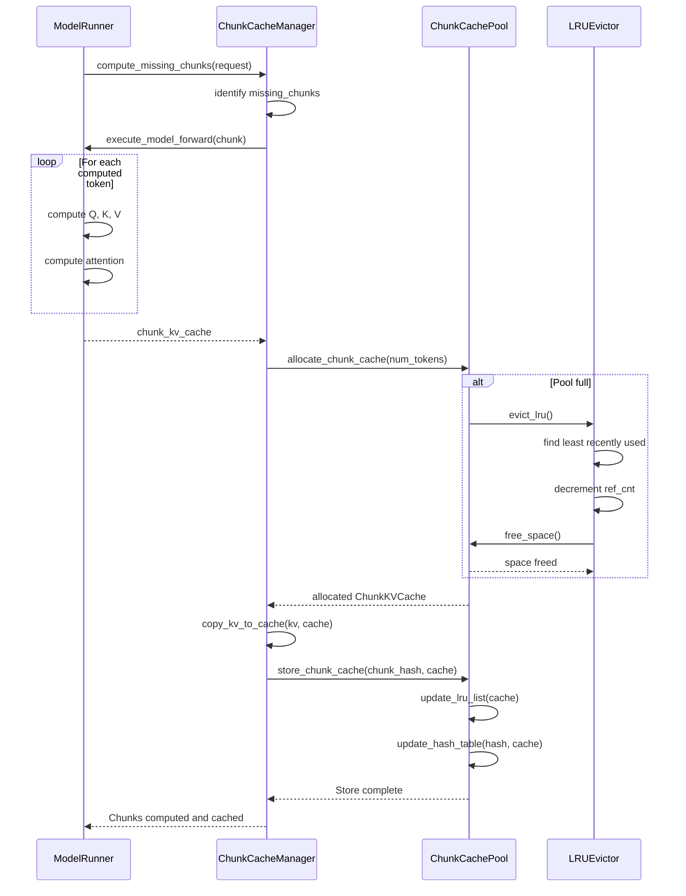
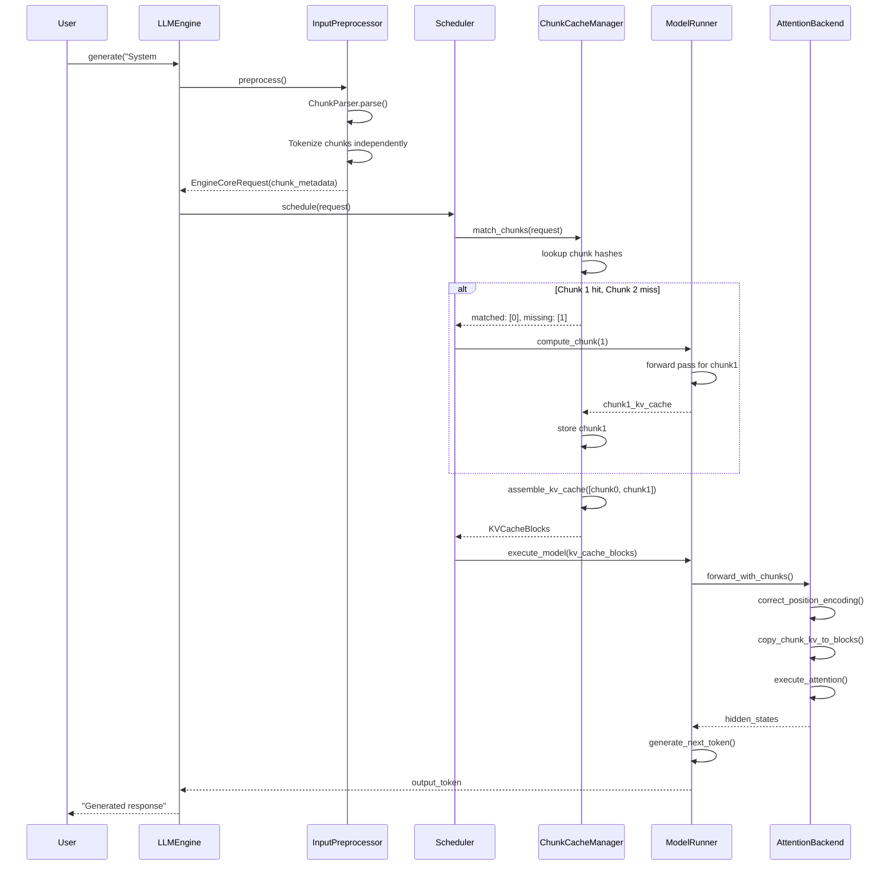

# Chunk Cache Design Document

## 概述

Chunk Cache 是一种位置无关的 KV Cache 缓存和复用机制,旨在扩展 vLLM-Ascend 的缓存能力。与现有的 Prefix Caching 不同,Chunk Cache 不依赖严格的位置匹配,而是基于内容哈希进行缓存匹配,允许在不同请求之间灵活复用 KV Cache。

### 核心特性

1. **位置无关缓存**: 通过内容哈希匹配缓存,忽略绝对位置信息
2. **独立 Chunk 处理**: 每个 Chunk 单独与系统提示构建 KV Cache,Chunk 之间无交叉注意力
3. **Token 粒度缓存**: 支持 Token 级别的精确缓存管理
4. **显存池管理**: 独立的显存池管理 Chunk Cache,大小可配置(默认 2GB)
5. **位置编码校正**: 自动处理位置编码重叠和偏移,确保模型正确性

### 与 Prefix Caching 的对比

| 特性 | Prefix Caching | Chunk Cache |
|------|----------------|-------------|
| 匹配策略 | 严格位置匹配 | 内容哈希匹配 |
| 位置依赖 | 是(通过 hash chain) | 否(独立哈希) |
| 缓存粒度 | Block 级别 | Token/Chunk 级别 |
| 复用灵活性 | 相同位置才能复用 | 任意位置可复用 |
| 适用场景 | 重复前缀 | 独立内容块 |

### 使用场景

典型的使用场景是系统提示与多个独立内容块的组合:

```
系统提示 + " # # " + chunk1 + " # # " + chunk2 + " # # " + chunk3 + " # # " + 用户问题
```

其中:
- `系统提示`: 公共上下文,与每个 Chunk 结合计算 KV Cache
- `chunk1, chunk2, chunk3`: 独立的内容块,各自与系统提示独立计算
- `用户问题`: 与所有内容进行交叉注意力,位置编码从最大位置开始

## 架构设计

### 整体架构图

```
┌─────────────────────────────────────────────────────────────────────────────┐
│                           vLLM-Ascend Chunk Cache                           │
└─────────────────────────────────────────────────────────────────────────────┘

                              ┌─────────────┐
                              │   User      │
                              │   Request   │
                              └──────┬──────┘
                                     │
                                     ▼
                    ┌─────────────────────────────────┐
                    │      Input Preprocessor         │
                    │  ┌─────────────────────────┐   │
                    │  │    Chunk Parser         │   │
                    │  │  - Parse "# #" delims   │   │
                    │  │  - Split into chunks    │   │
                    │  └─────────────────────────┘   │
                    │  ┌─────────────────────────┐   │
                    │  │    Tokenizer            │   │
                    │  │  - Tokenize chunks      │   │
                    │  │  - Compute hashes       │   │
                    │  └─────────────────────────┘   │
                    └──────────────┬──────────────────┘
                                   │
                                   ▼
                    ┌─────────────────────────────────┐
                    │     EngineCoreRequest           │
                    │  - request_id                   │
                    │  - prompt_token_ids             │
                    │  - chunk_metadata (NEW)         │
                    │    ├─ chunk_token_ids[]         │
                    │    ├─ chunk_hashes[]            │
                    │    └─ chunk_dependencies[]     │
                    └──────────────┬──────────────────┘
                                   │
                        ┌──────────┴──────────┐
                        │                     │
                        ▼                     ▼
        ┌───────────────────────┐  ┌─────────────────────────┐
        │   Contains "# #"?     │  │   Normal Request        │
        │   (Has Chunk Info)    │  │   (No Chunk Info)       │
        └───────────┬───────────┘  └──────────┬──────────────┘
                    │                         │
           Yes      │                         │ No
                    ▼                         ▼
    ┌─────────────────────────┐   ┌──────────────────────┐
    │  Chunk Cache Path       │   │  Prefix Caching Path │
    │  (NEW)                  │   │  (Existing)          │
    └────────────┬────────────┘   └──────────────────────┘
                 │
                 ▼
    ┌─────────────────────────────────────┐
    │     Chunk Cache Manager             │
    │  ┌───────────────────────────────┐  │
    │  │   Chunk Cache Pool            │  │
    │  │  - Token-granular storage     │  │
    │  │  - LRU eviction               │  │
    │  │  - Hash-based lookup          │  │
    │  │  - Configurable size (2GB)    │  │
    │  └───────────────────────────────┘  │
    │  ┌───────────────────────────────┐  │
    │  │   Chunk Matcher               │  │
    │  │  - Hash-based matching        │  │
    │  │  - Position-agnostic lookup   │  │
    │  └───────────────────────────────┘  │
    └────────────┬────────────────────────┘
                 │
                 ▼
    ┌─────────────────────────────────────┐
    │      Scheduler                      │
    │  - Chunk cache hit detection        │
    │  - KV cache allocation              │
    │  - Request scheduling               │
    └────────────┬────────────────────────┘
                 │
                 ▼
    ┌─────────────────────────────────────┐
    │      Model Runner                   │
    │  - Execute model forward            │
    │  - Chunk KV → PagedAttention        │
    │  - Position correction metadata     │
    └────────────┬────────────────────────┘
                 │
                 ▼
    ┌─────────────────────────────────────┐
    │   Attention Backend (Ascend)        │
    │  ┌───────────────────────────────┐  │
    │  │   Position Encoding Handler   │  │
    │  │  - Correct chunk positions    │  │
    │  │  - Handle overlapping offsets │  │
    │  │  - Compute sin/cos for reuse  │  │
    │  └───────────────────────────────┘  │
    │  ┌───────────────────────────────┐  │
    │  │   KV Cache Copier             │  │
    │  │  - Copy chunk KV to blocks    │  │
    │  │  - Assemble full sequence     │  │
    │  └───────────────────────────────┘  │
    └─────────────────────────────────────┘
                 │
                 ▼
    ┌─────────────────────────────────────┐
    │      vLLM PagedAttention            │
    │  - Standard attention execution     │
    │  - Block-based KV cache management  │
    └─────────────────────────────────────┘
```

### 核心组件

#### 1. Chunk Parser (新增)

**位置**: `vllm/inputs/chunk_parser.py`

**主要功能**:
- 解析 Prompt 中的 `# #` 分隔符
- 将 Prompt 分割为系统提示和多个 Chunk
- 构建 Chunk 之间的依赖关系
- 验证 Chunk 格式合法性

**对外接口**:
```python
class ChunkParser:
    def parse(self, prompt: str) -> ChunkParseResult:
        """解析包含 # # 分隔符的 prompt"""
        pass

    def has_chunks(self, prompt: str) -> bool:
        """检测 prompt 是否包含 chunk 分隔符"""
        pass

@dataclass
class ChunkParseResult:
    system_prompt: str           # 系统提示
    chunks: List[str]            # chunk 内容列表
    user_question: str           # 用户问题
    delimiters: List[int]        # 分隔符位置
```

#### 2. Chunk Metadata (新增)

**位置**: `vllm/v1/engine/chunk_metadata.py`

**主要功能**:
- 存储 Chunk 的 Token 信息
- 管理 Chunk 的内容哈希
- 跟踪 Chunk 之间的依赖关系
- 提供 Chunk 匹配所需的所有元数据

**对外接口**:
```python
@dataclass
class ChunkMetadata:
    chunk_id: str                    # Chunk 唯一标识
    token_ids: List[int]             # Chunk 的 Token IDs
    chunk_hash: str                  # 内容哈希(位置无关)
    position_offset: int             # 位置偏移量
    dependencies: List[str]          # 依赖的其他 Chunk IDs
    kv_cache_blocks: Optional[KVCacheBlocks]  # 缓存的 KV Cache

    def compute_hash(self) -> str:
        """计算位置无关的内容哈希"""
        pass
```

#### 3. Chunk Cache Pool (新增)

**位置**: `vllm_ascend/chunk/cache_pool.py`

**主要功能**:
- 管理 Token 粒度的 KV Cache 存储
- 实现 LRU 缓存淘汰策略
- 提供基于哈希的快速查找
- 支持可配置的显存大小(默认 2GB)

**对外接口**:
```python
class ChunkCachePool:
    def __init__(self, cache_size_gb: float = 2.0):
        """初始化 Chunk Cache Pool"""
        pass

    def get_chunk_cache(self, chunk_hash: str) -> Optional[ChunkKVCache]:
        """根据哈希查找已缓存的 Chunk KV Cache"""
        pass

    def store_chunk_cache(self, chunk_hash: str, kv_cache: ChunkKVCache) -> None:
        """存储 Chunk KV Cache 到池中"""
        pass

    def allocate_chunk_cache(self, num_tokens: int) -> ChunkKVCache:
        """为 Chunk 分配 KV Cache 空间"""
        pass

    def evict_lru(self) -> None:
        """淘汰最久未使用的 Chunk Cache"""
        pass

    def get_stats(self) -> CacheStats:
        """获取缓存统计信息"""
        pass
```

#### 4. Chunk Cache Manager (新增)

**位置**: `vllm_ascend/chunk/cache_manager.py`

**主要功能**:
- 协调 Chunk Cache 的生命周期管理
- 处理 Chunk 匹配和 KV Cache 组装
- 管理未命中 Chunk 的计算
- 与 Scheduler 协作进行缓存调度

**对外接口**:
```python
class ChunkCacheManager:
    def __init__(self, cache_pool: ChunkCachePool):
        """初始化 Chunk Cache Manager"""
        pass

    def match_chunks(self, request: Request) -> ChunkMatchResult:
        """匹配请求中的所有 Chunks,返回命中结果"""
        pass

    def compute_missing_chunks(
        self,
        request: Request,
        match_result: ChunkMatchResult
    ) -> None:
        """计算未命中的 Chunks 并存储到 Cache Pool"""
        pass

    def assemble_kv_cache(
        self,
        request: Request,
        match_result: ChunkMatchResult
    ) -> KVCacheBlocks:
        """组装完整的 KV Cache(复用 + 新计算)"""
        pass

@dataclass
class ChunkMatchResult:
    matched_chunks: Dict[int, ChunkKVCache]   # 命中的 Chunks (chunk_index → kv_cache)
    missing_chunks: List[int]                  # 未命中的 Chunk 索引
    hit_ratio: float                           # 命中率
```

#### 5. Input Preprocessor Enhancement (修改)

**位置**: `vllm/inputs/preprocess.py`

**修改内容**:
- 集成 ChunkParser 进行 Chunk 解析
- 对每个 Chunk 单独进行 Tokenization
- 计算 Chunk 的内容哈希
- 增强 EngineCoreRequest 添加 Chunk 元数据

**修改点**:
```python
class InputPreprocessor:
    def __init__(self, ...):
        self.chunk_parser = ChunkParser()  # 新增

    def _process_text(self, prompt: str, ...):
        # 原有逻辑...

        # 新增: 检测并处理 Chunks
        if self.chunk_parser.has_chunks(prompt):
            return self._process_chunked_prompt(prompt, ...)

        return result

    def _process_chunked_prompt(self, prompt: str, ...):
        """处理包含 Chunks 的 Prompt"""
        parse_result = self.chunk_parser.parse(prompt)

        # Tokenize system prompt
        system_tokens = self._tokenize_prompt(parse_result.system_prompt)

        # Tokenize each chunk independently
        chunk_metadata_list = []
        for chunk_text in parse_result.chunks:
            # Chunk 与 system prompt 结合 tokenize
            combined = system_tokens + self._tokenize_prompt(chunk_text)
            chunk_meta = ChunkMetadata(
                token_ids=combined,
                chunk_hash=compute_hash(combined),
                ...
            )
            chunk_metadata_list.append(chunk_meta)

        # Tokenize user question
        user_tokens = self._tokenize_prompt(parse_result.user_question)

        return EngineCoreRequest(
            prompt_token_ids=system_tokens + user_tokens,
            chunk_metadata=chunk_metadata_list,  # 新增字段
            ...
        )
```

#### 6. EngineCoreRequest Enhancement (修改)

**位置**: `vllm/v1/engine/__init__.py`

**修改内容**:
- 添加 `chunk_metadata` 字段存储 Chunk 信息
- 添加 `has_chunks` 标识是否使用 Chunk Cache

**修改点**:
```python
@define
class EngineCoreRequest:
    # 原有字段...
    request_id: str
    prompt_token_ids: List[int] | None
    prompt_embeds: Tensor | None
    ...

    # 新增字段
    chunk_metadata: List[ChunkMetadata] | None = field(default=None)
    has_chunks: bool = field(default=False)

    def get_chunk_hashes(self) -> List[str]:
        """获取所有 Chunk 的哈希值"""
        if not self.chunk_metadata:
            return []
        return [meta.chunk_hash for meta in self.chunk_metadata]
```

#### 7. Scheduler Enhancement (修改)

**位置**: `vllm/v1/scheduler.py`

**修改内容**:
- 检测请求是否包含 Chunk 信息
- 路由到 Chunk Cache Path 或 Prefix Caching Path
- 协调 Chunk Cache Manager 进行匹配
- 管理请求调度优先级

**修改点**:
```python
class Scheduler:
    def __init__(self, ..., chunk_cache_manager: ChunkCacheManager = None):
        # 原有初始化...
        self.chunk_cache_manager = chunk_cache_manager  # 新增

    def _schedule_request(self, request: Request):
        """调度单个请求"""
        if request.has_chunks:
            # 新的 Chunk Cache 路径
            return self._schedule_chunked_request(request)
        else:
            # 原有的 Prefix Caching 路径
            return self._schedule_normal_request(request)

    def _schedule_chunked_request(self, request: Request) -> SchedulingResult:
        """调度包含 Chunks 的请求"""
        # 1. 匹配 Chunks
        match_result = self.chunk_cache_manager.match_chunks(request)

        # 2. 如果有未命中的 Chunks,需要计算
        if match_result.missing_chunks:
            # 将请求移到计算队列
            return self._schedule_for_computation(request, match_result)
        else:
            # 全部命中,可以直接推理
            return self._schedule_for_inference(request, match_result)
```

#### 8. Attention Backend Enhancement (修改)

**位置**: `vllm_ascend/attention/attention_v1.py`

**修改内容**:
- 实现 Chunk KV Cache 到 PagedAttention 的拷贝
- 处理位置编码校正
- 支持 Chunk 位置的动态调整

**修改点**:
```python
class AscendAttentionBackend:
    def forward_with_chunks(
        self,
        hidden_states: Tensor,
        chunk_kv_caches: List[ChunkKVCache],
        position_offsets: List[int],
        ...
    ) -> Tensor:
        """使用 Chunk KV Cache 执行 Attention"""
        # 1. 计算 Chunk 位置编码
        corrected_cos, corrected_sin = self._compute_chunk_position_encoding(
            position_offsets
        )

        # 2. 拷贝 Chunk KV Cache 到 PagedAttention Blocks
        kv_cache_blocks = self._copy_chunk_kv_to_blocks(
            chunk_kv_caches
        )

        # 3. 执行 Attention
        output = self._execute_attention(
            hidden_states,
            kv_cache_blocks,
            corrected_cos,
            corrected_sin,
            ...
        )
        return output

    def _compute_chunk_position_encoding(
        self,
        position_offsets: List[int]
    ) -> Tuple[Tensor, Tensor]:
        """计算 Chunk 的校正后位置编码"""
        # 根据位置偏移重新计算 cos/sin
        # 处理 Chunk 之间的位置重叠
        pass

    def _copy_chunk_kv_to_blocks(
        self,
        chunk_kv_caches: List[ChunkKVCache]
    ) -> KVCacheBlocks:
        """将 Chunk KV Cache 拷贝到 PagedAttention Blocks"""
        # 按顺序拼接各个 Chunk 的 KV Cache
        # 分配 PagedAttention Blocks
        # 执行 KV 数据拷贝
        pass
```

### 数据流设计

```
┌─────────────────────────────────────────────────────────────────────────────┐
│                          Chunk Cache Data Flow                               │
└─────────────────────────────────────────────────────────────────────────────┘

Request Input
   │
   │ "System # # Chunk1 # # Chunk2 # # Question"
   │
   ▼
┌─────────────────────────────────────────────────────────────────────────────┐
│ Step 1: Chunk Preprocessing                                                  │
├─────────────────────────────────────────────────────────────────────────────┤
│  Input: Prompt with "# #" delims                                            │
│  ┌────────────────────────────────────────────────────────────────────┐     │
│  │  ChunkParser.parse()                                               │     │
│  │    ├─ Parse delimiters → Split into chunks                        │     │
│  │    ├─ Extract: system_prompt, chunks[1..N], user_question         │     │
│  │    └─ Validate chunk format                                       │     │
│  └────────────────────────────────────────────────────────────────────┘     │
│                                │                                             │
│                                ▼                                             │
│  ┌────────────────────────────────────────────────────────────────────┐     │
│  │  Tokenizer (per chunk)                                             │     │
│  │    ├─ Tokenize: system_prompt + chunk1 → tokens1, hash1           │     │
│  │    ├─ Tokenize: system_prompt + chunk2 → tokens2, hash2           │     │
│  │    ├─ Tokenize: system_prompt + chunk3 → tokens3, hash3           │     │
│  │    └─ Tokenize: user_question → user_tokens                       │     │
│  └────────────────────────────────────────────────────────────────────┘     │
│                                │                                             │
│                                ▼                                             │
│  Output: EngineCoreRequest                                                   │
│    ├─ prompt_token_ids: [system_tokens, user_tokens]                        │
│    ├─ chunk_metadata: [meta1, meta2, meta3]                                 │
│    │   └─ Each meta: token_ids, chunk_hash, position_offset                │
│    └─ has_chunks: true                                                      │
└─────────────────────────────────────────────────────────────────────────────┘
   │
   ▼
┌─────────────────────────────────────────────────────────────────────────────┐
│ Step 2: Chunk Matching (Scheduler)                                          │
├─────────────────────────────────────────────────────────────────────────────┤
│  Input: Request with chunk_metadata                                         │
│  ┌────────────────────────────────────────────────────────────────────┐     │
│  │  ChunkCacheManager.match_chunks()                                  │     │
│  │    ├─ For each chunk in request:                                  │     │
│  │    │   ├─ Lookup chunk_hash in ChunkCachePool                     │     │
│  │    │   ├─ If found: Add to matched_chunks                         │     │
│  │    │   └─ If not found: Add to missing_chunks                     │     │
│  │    └─ Return ChunkMatchResult                                      │     │
│  └────────────────────────────────────────────────────────────────────┘     │
│                                │                                             │
│                                ▼                                             │
│  Output: ChunkMatchResult                                                   │
│    ├─ matched_chunks: {0: kv_cache1, 2: kv_cache3}  (chunk 0 and 2 hit)    │
│    ├─ missing_chunks: [1]                            (chunk 1 miss)         │
│    └─ hit_ratio: 0.67                                                   │
└─────────────────────────────────────────────────────────────────────────────┘
   │
   ├─────────────────────────────────────────────────────────────┐
   │                                                             │
   ▼                                                             ▼
[Cache Hit]                                                  [Cache Miss]
   │                                                             │
   │ Step 3a: Assemble KV Cache                                  │ Step 3b: Compute Missing Chunks
   │                                                             │
   │ ┌────────────────────────────────────────────────────────┐ │ ┌────────────────────────────────┐
   │ │ Copy chunk KV caches to PagedAttention Blocks          │ │ │ ChunkCacheManager             │
   │ │  ┌──────────────────────────────────────────────────┐  │ │ │ .compute_missing_chunks()     │
   │ │  │ chunk1_kv ──┐                                     │ │ │   ├─ Run model forward for    │
   │ │  │ chunk3_kv ──┼──► Assemble ──► Full KV Cache      │ │ │ │ │   missing chunk1            │
   │ │  └─────────────┘                                     │ │ │   ├─ Store in ChunkCachePool  │
   │ └────────────────────────────────────────────────────────┘ │ │   └─ Return updated result    │
   │                                                             │ └────────────────────────────────┘
   │                                                             │                 │
   ▼                                                             │                 ▼
┌─────────────────────────────────────────────────────────────────────────────┐
│ Step 4: Position Encoding Correction                                         │
├─────────────────────────────────────────────────────────────────────────────┤
│  ┌────────────────────────────────────────────────────────────────────┐     │
│  │  Compute Position Offsets                                           │     │
│  │    ├─ chunk1_end = len(chunk1_tokens)                              │     │
│  │    ├─ chunk2_end = chunk1_end + len(chunk2_tokens)                 │     │
│  │    ├─ chunk3_end = chunk2_end + len(chunk3_tokens)                 │     │
│  │    └─ user_start = max(chunk1_end, chunk2_end, chunk3_end)         │     │
│  └────────────────────────────────────────────────────────────────────┘     │
│                                │                                             │
│                                ▼                                             │
│  ┌────────────────────────────────────────────────────────────────────┐     │
│  │  Correct Position Encoding for Chunks                              │     │
│  │    ├─ chunk1: positions [0, chunk1_end)                            │     │
│  │    ├─ chunk2: positions [0, chunk2_end)  (overlaps with chunk1)    │     │
│  │    ├─ chunk3: positions [0, chunk3_end)  (overlaps with chunk1,2)  │     │
│  │    └─ user: positions [user_start, ...)                            │     │
│  └────────────────────────────────────────────────────────────────────┘     │
│                                │                                             │
│                                ▼                                             │
│  ┌────────────────────────────────────────────────────────────────────┐     │
│  │  Recompute RoPE cos/sin for each chunk                             │     │
│  │    ├─ cos_chunk1, sin_chunk1 = rope(positions[0:chunk1_end])       │     │
│  │    ├─ cos_chunk2, sin_chunk2 = rope(positions[0:chunk2_end])       │     │
│  │    ├─ cos_chunk3, sin_chunk3 = rope(positions[0:chunk3_end])       │     │
│  │    └─ cos_user, sin_user = rope(positions[user_start:])            │     │
│  └────────────────────────────────────────────────────────────────────┘     │
└─────────────────────────────────────────────────────────────────────────────┘
   │
   ▼
┌─────────────────────────────────────────────────────────────────────────────┐
│ Step 5: Attention Execution                                                 │
├─────────────────────────────────────────────────────────────────────────────┤
│  ┌────────────────────────────────────────────────────────────────────┐     │
│  │  AscendAttentionBackend.forward()                                  │     │
│  │    ├─ Input: hidden_states, kv_cache_blocks, position_encoding     │     │
│  │    ├─ Apply corrected RoPE to Q, K                                │     │
│  │    ├─ Compute attention scores                                    │     │
│  │    ├─ Apply attention weights to V                                │     │
│  │    └─ Return output                                               │     │
│  └────────────────────────────────────────────────────────────────────┘     │
└─────────────────────────────────────────────────────────────────────────────┘
   │
   ▼
Output: Generated Tokens
```

## 主要流程

### 1. Chunk 预处理流程



### 2. Chunk 匹配与缓存查找流程



### 3. 位置编码校正流程



### 4. Chunk Cache 存储流程



### 5. 端到端推理流程



## 相关代码

### 新增文件

```
vllm/
├── inputs/
│   └── chunk_parser.py                    # Chunk 解析器
│       - class ChunkParser
│       - class ChunkParseResult
│
└── v1/
    └── engine/
        └── chunk_metadata.py               # Chunk 元数据定义
            - class ChunkMetadata
            - class ChunkHashUtils

vllm_ascend/
└── chunk/
    ├── __init__.py
    ├── cache_pool.py                       # Chunk 缓存池
    │   - class ChunkCachePool
    │   - class ChunkKVCache
    │   - class CacheStats
    │
    ├── cache_manager.py                    # Chunk 缓存管理器
    │   - class ChunkCacheManager
    │   - class ChunkMatchResult
    │
    └── hash_utils.py                       # 哈希计算工具
        - def compute_chunk_hash()
        - def verify_chunk_integrity()
```

### 修改文件

#### 1. `vllm/inputs/preprocess.py`

**关键修改点**:
```python
# 在 InputPreprocessor 类中新增:
class InputPreprocessor:
    def __init__(self, ...):
        # 原有初始化...
        from vllm.inputs.chunk_parser import ChunkParser
        self.chunk_parser = ChunkParser()

    def _process_text(self, prompt: str, ...):
        # 检测是否包含 Chunks
        if self.chunk_parser.has_chunks(prompt):
            return self._process_chunked_prompt(prompt, ...)

        # 原有逻辑...
        return result

    def _process_chunked_prompt(self, prompt: str, ...):
        """处理包含 # # 分隔符的 Prompt"""
        from vllm.v1.engine.chunk_metadata import ChunkMetadata

        parse_result = self.chunk_parser.parse(prompt)

        # Tokenize system prompt
        system_tokens = self._tokenize_prompt(parse_result.system_prompt)

        # 处理每个 Chunk
        chunk_metadata_list = []
        for chunk_text in parse_result.chunks:
            combined = system_tokens + self._tokenize_prompt(chunk_text)
            chunk_hash = compute_chunk_hash(combined)

            chunk_meta = ChunkMetadata(
                chunk_id=generate_uuid(),
                token_ids=combined,
                chunk_hash=chunk_hash,
                position_offset=0,  # 稍后计算
                dependencies=[],
                kv_cache_blocks=None
            )
            chunk_metadata_list.append(chunk_meta)

        # Tokenize user question
        user_tokens = self._tokenize_prompt(parse_result.user_question)

        return EngineCoreRequest(
            prompt_token_ids=system_tokens + user_tokens,
            chunk_metadata=chunk_metadata_list,
            has_chunks=True,
            ...
        )
```

#### 2. `vllm/v1/engine/__init__.py`

**关键修改点**:
```python
# 在 EngineCoreRequest 中新增字段:
@define
class EngineCoreRequest:
    # 原有字段...
    request_id: str
    prompt_token_ids: List[int] | None = field(default=None)

    # 新增字段
    chunk_metadata: List["ChunkMetadata"] | None = field(default=None)
    has_chunks: bool = field(default=False)

    def get_chunk_hashes(self) -> List[str]:
        """获取所有 Chunk 的哈希值"""
        if not self.chunk_metadata:
            return []
        return [meta.chunk_hash for meta in self.chunk_metadata]
```

#### 3. `vllm/v1/scheduler.py`

**关键修改点**:
```python
# 在 Scheduler 类中新增:
class Scheduler:
    def __init__(
        self,
        ...,
        chunk_cache_manager: "ChunkCacheManager" = None,
    ):
        # 原有初始化...
        self.chunk_cache_manager = chunk_cache_manager

    def _schedule_request(self, request: Request) -> SchedulingResult:
        """调度单个请求"""
        if request.has_chunks and self.chunk_cache_manager:
            # 使用 Chunk Cache 路径
            return self._schedule_chunked_request(request)
        else:
            # 使用原有的 Prefix Caching 路径
            return self._schedule_normal_request(request)

    def _schedule_chunked_request(
        self,
        request: Request
    ) -> SchedulingResult:
        """调度包含 Chunks 的请求"""
        # 匹配 Chunks
        match_result = self.chunk_cache_manager.match_chunks(request)

        if match_result.missing_chunks:
            # 需要计算未命中的 Chunks
            return self._schedule_for_computation(request, match_result)
        else:
            # 全部命中,可以组装 KV Cache
            kv_blocks = self.chunk_cache_manager.assemble_kv_cache(
                request, match_result
            )
            request.num_cached_tokens = sum(
                len(meta.token_ids) for meta in request.chunk_metadata
            )
            return self._schedule_for_inference(request, kv_blocks)
```

#### 4. `vllm_ascend/attention/attention_v1.py`

**关键修改点**:
```python
# 在 AscendAttentionBackend 类中新增方法:
class AscendAttentionBackend:
    def forward_with_chunks(
        self,
        hidden_states: Tensor,
        chunk_kv_caches: List["ChunkKVCache"],
        position_offsets: List[int],
        attn_metadata: "AscendCommonAttentionMetadata",
    ) -> Tensor:
        """使用 Chunk KV Cache 执行 Attention"""
        # 1. 计算校正后的位置编码
        corrected_cos, corrected_sin = self._compute_chunk_position_encoding(
            position_offsets
        )

        # 2. 拷贝 Chunk KV Cache 到 PagedAttention Blocks
        kv_cache_blocks = self._copy_chunk_kv_to_blocks(chunk_kv_caches)

        # 3. 更新 attention metadata
        attn_metadata.chunk_kv_blocks = kv_cache_blocks

        # 4. 执行 Attention
        output = self.forward(
            hidden_states=hidden_states,
            attn_metadata=attn_metadata,
        )

        return output

    def _compute_chunk_position_encoding(
        self,
        position_offsets: List[int]
    ) -> Tuple[Tensor, Tensor]:
        """计算 Chunk 的校正后位置编码"""
        from vllm_ascend.attention.rotary import set_cos_and_sin

        # 计算最大位置
        max_position = max(position_offsets) if position_offsets else 0

        # 调用 RoPE 计算接口
        cos, sin = set_cos_and_sin(
            self.vllm_config,
            max_num_reqs=1,
            decode_token_per_req=max_position,
            dtype=self.dtype,
            device=self.device,
        )

        return cos, sin

    def _copy_chunk_kv_to_blocks(
        self,
        chunk_kv_caches: List["ChunkKVCache"]
    ) -> KVCacheBlocks:
        """将 Chunk KV Cache 拷贝到 PagedAttention Blocks"""
        from vllm.v1.core.kv_cache_manager import KVCacheBlocks

        # 分配 PagedAttention blocks
        total_tokens = sum(cache.num_tokens for cache in chunk_kv_caches)
        num_blocks = (total_tokens + self.block_size - 1) // self.block_size

        kv_blocks = self.block_allocator.allocate(num_blocks)

        # 拷贝 KV 数据
        token_offset = 0
        for chunk_kv in chunk_kv_caches:
            block_idx = token_offset // self.block_size
            block_offset = token_offset % self.block_size

            self._copy_kv_to_block(
                chunk_kv.key_cache,
                chunk_kv.value_cache,
                kv_blocks,
                block_idx,
                block_offset,
            )

            token_offset += chunk_kv.num_tokens

        return kv_blocks
```

#### 5. `vllm_ascend/worker.py`

**关键修改点**:
```python
# 在 NPUWorker 初始化中添加 Chunk Cache Manager:
class NPUWorker(WorkerBase):
    def __init__(self, vllm_config, local_rank, rank, distributed_init_method):
        # 原有初始化...

        # 新增: 初始化 Chunk Cache Manager
        from vllm_ascend.chunk.cache_manager import ChunkCacheManager
        from vllm_ascend.chunk.cache_pool import ChunkCachePool

        chunk_cache_size_gb = vllm_config.model_config.chunk_cache_size_gb or 2.0
        chunk_cache_pool = ChunkCachePool(cache_size_gb=chunk_cache_size_gb)
        self.chunk_cache_manager = ChunkCacheManager(cache_pool=chunk_cache_pool)

        # 传递给 ModelRunner
        self.model_runner.chunk_cache_manager = self.chunk_cache_manager
```

### 参考文件

以下文件提供实现参考,无需修改:

- `vllm/v1/core/block_pool.py` - Block 管理和 LRU 淘汰策略
- `vllm/v1/core/kv_cache_manager.py` - KV Cache 协调逻辑
- `vllm/v1/core/kv_cache_utils.py` - 哈希计算工具函数
- `vllm_ascend/attention/rotary.py` - RoPE 位置编码计算

## 使用说明

### 基本用法

#### 1. 格式化 Prompt

使用 `# #` 分隔符来标记不同的 Chunk:

```python
from vllm import LLM

# 示例 1: 系统 prompt + 多个文档 + 用户问题
prompt = """
你是一个专业的文档分析助手。 # #

文档 1: vLLM 是一个高性能的 LLM 推理引擎... # #

文档 2: Prefix Caching 是一种基于位置的缓存技术... # #

文档 3: Chunk Cache 是一种位置无关的缓存机制... # #

问题: 请对比 Prefix Caching 和 Chunk Cache 的区别。
"""

llm = LLM(model="Qwen/Qwen2.5-7B-Instruct")
output = llm.generate(prompt)
print(output[0].outputs[0].text)
```

#### 2. 配置 Chunk Cache 大小

```python
from vllm import LLM
import os

# 方式 1: 通过环境变量
os.environ["VLLM_CHUNK_CACHE_SIZE_GB"] = "4.0"  # 设置为 4GB

llm = LLM(model="Qwen/Qwen2.5-7B-Instruct")

# 方式 2: 通过配置参数 (未来支持)
# llm = LLM(
#     model="Qwen/Qwen2.5-7B-Instruct",
#     chunk_cache_config={"cache_size_gb": 4.0}
# )
```

#### 3. 启用/禁用 Chunk Cache

```python
from vllm import LLM

# 默认启用,使用 # # 分隔符自动触发
llm = LLM(model="Qwen/Qwen2.5-7B-Instruct")

# 禁用 Chunk Cache (使用环境变量)
import os
os.environ["VLLM_ENABLE_CHUNK_CACHE"] = "false"
llm = LLM(model="Qwen/Qwen2.5-7B-Instruct")
```

### API 接口

#### EngineCoreRequest 扩展

```python
@define
class EngineCoreRequest:
    # 原有字段...

    # Chunk 相关字段
    chunk_metadata: List[ChunkMetadata] | None = None  # Chunk 元数据列表
    has_chunks: bool = False                           # 是否包含 Chunks

    def get_chunk_hashes(self) -> List[str]:
        """获取所有 Chunk 的哈希值"""
        if not self.chunk_metadata:
            return []
        return [meta.chunk_hash for meta in self.chunk_metadata]

    def get_total_chunk_tokens(self) -> int:
        """获取所有 Chunk 的总 Token 数"""
        if not self.chunk_metadata:
            return 0
        return sum(len(meta.token_ids) for meta in self.chunk_metadata)
```

#### ChunkMetadata 定义

```python
@dataclass
class ChunkMetadata:
    """Chunk 元数据"""
    chunk_id: str                          # Chunk 唯一标识
    token_ids: List[int]                   # Chunk 的 Token IDs
    chunk_hash: str                        # 内容哈希(位置无关)
    position_offset: int                   # 位置偏移量
    dependencies: List[str]                # 依赖的其他 Chunk IDs
    kv_cache_blocks: Optional[KVCacheBlocks]  # 缓存的 KV Cache

    def compute_hash(self) -> str:
        """计算位置无关的内容哈希"""
        from vllm_ascend.chunk.hash_utils import compute_chunk_hash
        self.chunk_hash = compute_chunk_hash(self.token_ids)
        return self.chunk_hash
```

#### ChunkCacheManager 接口

```python
class ChunkCacheManager:
    """Chunk Cache 管理器"""

    def match_chunks(self, request: Request) -> ChunkMatchResult:
        """
        匹配请求中的所有 Chunks

        Args:
            request: 包含 chunk_metadata 的请求

        Returns:
            ChunkMatchResult: 匹配结果,包含命中和未命中的 Chunks
        """
        pass

    def compute_missing_chunks(
        self,
        request: Request,
        match_result: ChunkMatchResult
    ) -> None:
        """
        计算未命中的 Chunks 并存储到 Cache Pool

        Args:
            request: 请求对象
            match_result: 匹配结果
        """
        pass

    def assemble_kv_cache(
        self,
        request: Request,
        match_result: ChunkMatchResult
    ) -> KVCacheBlocks:
        """
        组装完整的 KV Cache(复用 + 新计算)

        Args:
            request: 请求对象
            match_result: 匹配结果

        Returns:
            KVCacheBlocks: 完整的 KV Cache blocks
        """
        pass

    def get_cache_stats(self) -> CacheStats:
        """获取缓存统计信息"""
        return self.cache_pool.get_stats()
```

#### ChunkMatchResult 定义

```python
@dataclass
class ChunkMatchResult:
    """Chunk 匹配结果"""
    matched_chunks: Dict[int, ChunkKVCache]  # 命中的 Chunks (chunk_index → kv_cache)
    missing_chunks: List[int]                 # 未命中的 Chunk 索引
    hit_ratio: float                          # 命中率 (0.0 - 1.0)

    def get_hit_count(self) -> int:
        """获取命中的 Chunk 数量"""
        return len(self.matched_chunks)

    def get_miss_count(self) -> int:
        """获取未命中的 Chunk 数量"""
        return len(self.missing_chunks)
```

### 性能调优

#### 1. Chunk Cache 大小配置

```python
# 根据 Chunk 大小和数量调整缓存大小
# 公式: cache_size >= avg_chunk_size * expected_concurrent_requests

# 示例:
# - 平均 Chunk 大小: 1000 tokens
# - 预期并发请求数: 10
# - 每个 token KV Cache 大小: ~2KB (假设 key+value, fp16)
# - 推荐缓存大小: 1000 * 10 * 2KB = 20MB
# - 安全余量 (2x): 40MB

# 默认 2GB 适用于大多数场景
os.environ["VLLM_CHUNK_CACHE_SIZE_GB"] = "2.0"
```

#### 2. Chunk 拆分策略

```python
# 好的 Chunk 拆分示例
good_prompt = """
系统指令... # #

独立的文档 1... # #

独立的文档 2... # #

独立的文档 3... # #

用户问题
"""

# 避免的拆分方式
bad_prompt = """
系统指令... # #

不完整的句子... # #

...续写 # #
"""
```

#### 3. 监控缓存命中率

```python
from vllm import LLM

llm = LLM(model="Qwen/Qwen2.5-7B-Instruct")

# 获取缓存统计
chunk_cache_manager = llm.llm_engine.driver_worker.chunk_cache_manager
stats = chunk_cache_manager.get_cache_stats()

print(f"缓存命中率: {stats.hit_rate:.2%}")
print(f"缓存使用率: {stats.usage_ratio:.2%}")
print(f"命中次数: {stats.hit_count}")
print(f"未命中次数: {stats.miss_count}")
```

### 使用场景示例

#### 场景 1: RAG 应用

```python
from vllm import LLM

# RAG 场景: 系统提示 + 检索到的文档 + 用户问题
system_prompt = "你是一个专业的客服助手,请根据以下文档回答用户问题。"

retrieved_docs = [
    "产品手册: vLLM-Ascend 是华为昇腾 NPU 适配版本...",
    "FAQ: 如何配置 Chunk Cache? 需要设置环境变量...",
    "案例: 某客户使用后吞吐提升 3 倍...",
]

user_question = "如何启用 Chunk Cache 功能?"

# 构造 Chunk Cache 格式的 prompt
prompt = f"{system_prompt} # # {' # # '.join(retrieved_docs)} # # {user_question}"

llm = LLM(model="Qwen/Qwen2.5-7B-Instruct")
output = llm.generate(prompt)
```

#### 场景 2: 多文档分析

```python
from vllm import LLM

# 多文档对比分析
system = "请对比以下三篇技术文档的核心观点。"

docs = [
    "文档 A: Prefix Caching 采用严格的位置匹配...",
    "文档 B: Chunk Cache 采用内容哈希匹配...",
    "文档 C: 混合缓存策略结合两者优势...",
]

question = "哪种策略更适合动态场景?"

prompt = f"{system} # # {' # # '.join(docs)} # # {question}"

llm = LLM(model="Qwen/Qwen2.5-7B-Instruct")
output = llm.generate(prompt)
```

#### 场景 3: 批量处理

```python
from vllm import LLM

# 批量处理多个请求,共享相同的 Chunks
system = "分析以下数据并给出结论."

shared_chunks = [
    "数据集 1: 2024年 Q1 销售数据...",
    "数据集 2: 2024年 Q2 销售数据...",
    "数据集 3: 2024年 Q3 销售数据...",
]

questions = [
    "总销售额是多少?",
    "同比增长率?",
    "下季度预测?",
]

llm = LLM(model="Qwen/Qwen2.5-7B-Instruct")

# 第一个请求会计算并缓存所有 Chunks
# 后续请求直接复用缓存
prompts = [
    f"{system} # # {' # # '.join(shared_chunks)} # # {q}"
    for q in questions
]

outputs = llm.generate(prompts)
```

### 注意事项

1. **分隔符格式**: 必须使用 `# #` (带空格)作为分隔符,前后建议加空格
2. **系统提示位置**: 系统提示必须在第一个 `# #` 之前
3. **用户问题位置**: 用户问题必须在最后一个 `# #` 之后
4. **Chunk 独立性**: 每个 Chunk 会独立与系统提示计算 KV Cache,Chunk 之间无交叉注意力
5. **与 Prefix Caching 互斥**: 当检测到 `# #` 分隔符时,会自动禁用 Prefix Caching
6. **位置编码**: Chunk 的位置编码会有重叠,这是预期行为
7. **内存管理**: Chunk Cache 使用独立的显存池,不会占用 PagedAttention 的显存

### 配置选项

| 环境变量 | 默认值 | 说明 |
|---------|--------|------|
| `VLLM_CHUNK_CACHE_SIZE_GB` | 2.0 | Chunk Cache 池大小(GB) |
| `VLLM_ENABLE_CHUNK_CACHE` | true | 是否启用 Chunk Cache |
| `VLLM_CHUNK_CACHE_LRU_THRESHOLD` | 0.9 | LRU 淘汰阈值(使用率) |
| `VLLM_CHUNK_CACHE_HASH_ALGORITHM` | sha256 | Chunk 哈希算法 |

## 技术优势与挑战

### 优势

1. **高缓存复用率**
   - 位置无关匹配,相同内容在不同请求间可复用
   - 适用于动态场景,内容相同位置不同也能命中

2. **灵活性**
   - 用户可自由定义 Chunk 边界
   - 支持任意数量的 Chunk 组合

3. **独立管理**
   - 独立的显存池,不影响 PagedAttention
   - 可独立配置大小和管理策略

4. **与 vLLM 生态兼容**
   - 通过插件方式集成,不修改核心代码
   - 与 Prefix Caching 共存,自动路由

### 挑战与解决方案

| 挑战 | 解决方案 |
|------|---------|
| **位置编码重叠** | 在 Attention Backend 动态计算校正后的 RoPE |
| **Chunk 依赖管理** | 每个 Chunk 独立与系统提示计算,避免跨 Chunk 依赖 |
| **显存碎片化** | 使用 Token 粒度的连续分配,定期整理碎片 |
| **哈希碰撞** | 使用 SHA256 强哈希,碰撞概率极低 |
| **Cache 一致性** | Chunk 完全由内容决定,无需额外一致性机制 |

## 性能预期

### 缓存命中率

- **静态文档集**: 80-95% 命中率
- **动态文档集**: 50-70% 命中率
- **完全随机**: 0-20% 命中率

### 加速比

- **首次请求**: 无加速(需计算并缓存)
- **后续请求(全部命中)**: 3-10x 加速(取决于 Chunk 大小)
- **部分命中**: 1.5-5x 加速(取决于命中率)

### 显存占用

- **默认配置**: 2GB Chunk Cache + 标准 PagedAttention
- **可配置**: 根据实际需求调整
- **自动淘汰**: LRU 策略确保不会溢出

## 未来扩展

1. **支持多模态 Chunks**: 扩展到图像、音频等多模态内容
2. **持久化缓存**: 将 Chunk Cache 保存到磁盘,跨实例复用
3. **分布式缓存**: 跨多个实例共享 Chunk Cache
4. **智能 Chunk 划分**: 自动分析 Prompt 并优化 Chunk 边界
5. **混合缓存策略**: 结合 Prefix Caching 和 Chunk Cache 的优势

## 总结

Chunk Cache 为 vLLM-Ascend 提供了一种灵活的位置无关 KV Cache 缓存机制,特别适用于系统提示与多个独立文档组合的场景。通过内容哈希匹配和独立显存池管理,实现了高效的缓存复用,显著提升了推理性能。

该设计与 vLLM 现有架构无缝集成,通过插件方式实现,保持了良好的兼容性和可维护性。
