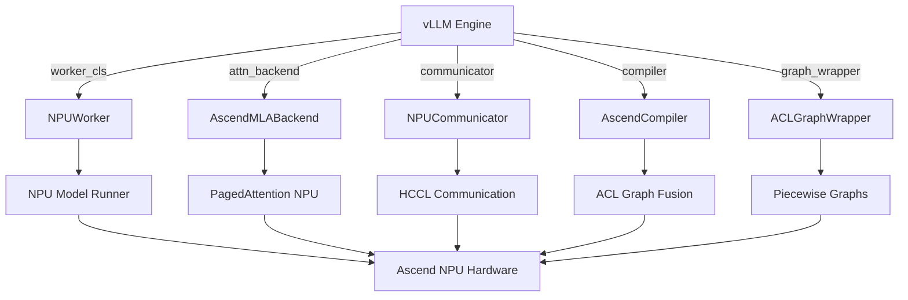

# vLLM-Ascend 平台插件架构详解

## 概述

vLLM-Ascend 通过 vLLM 的**平台插件架构（RFC #11162）**实现与 vLLM 的集成，这是一个**插件式而非 fork**的设计。当用户使用 `vllm serve` 等命令启动服务时，vllm-ascend 的修改会自动生效，无需修改 vLLM 核心代码。

本文档详细解释 vllm-ascend 如何通过插件机制确保其改动在运行时生效，以及整个平台插件的工作原理。

## 架构设计

### 整体架构图

```
┌─────────────────────────────────────────────────────────────────────┐
│                         用户命令层                                    │
│                     vllm serve --model llama                         │
└────────────────────────────┬────────────────────────────────────────┘
                             │
                             ▼
┌─────────────────────────────────────────────────────────────────────┐
│                       vLLM 核心层                                     │
│                  (vllm/ 目录 - 无需修改)                              │
│  ┌───────────────────────────────────────────────────────────────┐  │
│  │                    vllm.platforms                            │  │
│  │   - current_platform (懒加载触发器)                            │  │
│  │   - resolve_current_platform_cls_qualname()                   │  │
│  │   - load_plugins_by_group()                                   │  │
│  └───────────────────────────────────────────────────────────────┘  │
└────────────────────────────┬────────────────────────────────────────┘
                             │
                             ▼
┌─────────────────────────────────────────────────────────────────────┐
│                    Python Entry Points 机制                          │
│         (通过 importlib.metadata.entry_points 发现插件)                │
│  ┌───────────────────────────────────────────────────────────────┐  │
│  │              vllm.platform_plugins                            │  │
│  │          ascend = vllm_ascend:register                        │  │
│  └───────────────────────────────────────────────────────────────┘  │
└────────────────────────────┬────────────────────────────────────────┘
                             │
                             ▼
┌─────────────────────────────────────────────────────────────────────┐
│                    vllm-ascend 插件层                                 │
│                  (vllm-ascend/ 目录)                                  │
│  ┌───────────────────────────────────────────────────────────────┐  │
│  │              NPUPlatform (核心类)                              │  │
│  │   - check_and_update_config()    【关键方法】                  │  │
│  │   - get_attn_backend_cls()                                     │  │
│  │   - get_device_communicator_cls()                              │  │
│  │   - get_compile_backend()                                       │  │
│  └───────────────────────────────────────────────────────────────┘  │
│                              │                                       │
│         ┌────────────────────┼────────────────────┐                  │
│         │                    │                    │                  │
│         ▼                    ▼                    ▼                  │
│  ┌──────────┐        ┌──────────────┐    ┌──────────────┐           │
│  │  Worker  │        │ Attention    │    │ Distributed  │           │
│  │ NPUWorker│        │  Backends    │    │Communicator  │           │
│  └──────────┘        └──────────────┘    └──────────────┘           │
│                                                                     │
│  ┌──────────┐        ┌──────────────┐    ┌──────────────┐           │
│  │ Compiler │        │  Graph       │    │ Custom Ops   │           │
│  │  ACL     │        │  Wrapper     │    │   & Kernels  │           │
│  └──────────┘        └──────────────┘    └──────────────┘           │
└─────────────────────────────────────────────────────────────────────┘
                             │
                             ▼
┌─────────────────────────────────────────────────────────────────────┐
│                   Huawei Ascend NPU 硬件层                            │
│                      (CANN + 算子库)                                  │
└─────────────────────────────────────────────────────────────────────┘
```

### 核心模块说明

| 模块 | 位置 | 主要功能 |
|------|------|----------|
| **vLLM Core** | `vllm/` | 无需修改，提供平台插件接口和通用推理引擎 |
| **Plugin Registry** | `vllm-ascend/setup.py` | 通过 entry_points 注册插件 |
| **NPUPlatform** | `vllm-ascend/vllm_ascend/platform.py` | 平台核心类，实现 Platform 接口 |
| **NPUWorker** | `vllm-ascend/vllm_ascend/worker/` | NPU 特定的 worker 实现 |
| **Attention Backends** | `vllm-ascend/vllm_ascend/attention/` | MLA/SFA/Regular attention |
| **Compiler** | `vllm-ascend/vllm_ascend/compilation/` | ACL Graph 编译器 |
| **Distributed** | `vllm-ascend/vllm_ascend/distributed/` | NPU 通信和并行 |

### 平台接口（Platform Interface）

`vllm.platforms.interface.Platform` 定义了插件必须实现的接口：

```python
class Platform(ABC):
    @classmethod
    def check_and_update_config(cls, vllm_config: VllmConfig) -> None:
        """【关键】修改 vLLM 配置，设置 NPU 特定组件"""
        pass

    @classmethod
    def get_attn_backend_cls(cls, selected_backend, config) -> str:
        """返回 attention backend 类名"""
        pass

    @classmethod
    def get_device_communicator_cls(cls) -> str:
        """返回设备通信类名"""
        pass

    @classmethod
    def get_compile_backend(cls) -> str:
        """返回编译器类名"""
        pass
```

## 主要流程

### 1. 插件注册流程

```mermaid
sequenceDiagram
    User->>pip install: 安装 vllm-ascend
    pip install->>setup.py: 读取 entry_points
    setup.py->>Python Metadata: 注册插件
    Note over Python Metadata:
        vllm.platform_plugins:
          ascend = vllm_ascend:register

        vllm.general_plugins:
          ascend_kv_connector = vllm_ascend:register_connector
          ascend_model_loader = vllm_ascend:register_model_loader
```

### 2. 插件加载流程

```mermaid
sequenceDiagram
    User->>CLI: vllm serve --model llama
    CLI->>vLLM Core: 初始化
    vLLM Core->>vllm.platforms: 导入模块
    vLLM Core->>current_platform: 访问当前平台
    current_platform->>resolve_current_platform_cls_qualname(): 触发懒加载
    resolve_current_platform_cls_qualname()->>load_plugins_by_group(): 加载平台插件
    load_plugins_by_group()->>importlib.metadata: 读取 entry_points
    importlib.metadata-->>load_plugins_by_group(): 返回插件列表
    load_plugins_by_group()->>vllm_ascend.register(): 调用注册函数
    vllm_ascend.register()-->>load_plugins_by_group(): "vllm_ascend.platform.NPUPlatform"
    load_plugins_by_group()->>NPUPlatform: 实例化平台类
    NPUPlatform->>check_and_update_config(): 修改配置
```

### 3. 配置修改流程

```mermaid
sequenceDiagram
    NPUPlatform->>check_and_update_config(): 开始配置修改
    check_and_update_config()->>parallel_config: 设置 worker_cls
    Note over parallel_config:
        worker_cls = "vllm_ascend.worker.worker.NPUWorker"

    check_and_update_config()->>compilation_config: 设置编译器
    Note over compilation_config:
        oot_compiler = "vllm_ascend.compilation.compiler_interface.AscendCompiler"

    check_and_update_config()->>compilation_config: 配置 ACL Graph
    Note over compilation_config:
        cudagraph_mode = PIECEWISE
        use_inductor = False

    check_and_update_config()->>cache_config: 刷新 block_size
    check_and_update_config()->>scheduler_config: 设置动态调度器

    check_and_update_config()->>vllm_config: 返回修改后的配置
    vllm_config->>LLMEngine: 使用新配置初始化
    LLMEngine->>NPUWorker: 创建 NPU worker
    NPUWorker->>AscendMLABackend: 使用 NPU attention
```

### 4. 运行时组件替换



## 相关代码

### 插件注册

**文件**: `vllm-ascend/setup.py`

```python
entry_points={
    "vllm.platform_plugins": ["ascend = vllm_ascend:register"],
    "vllm.general_plugins": [
        "ascend_kv_connector = vllm_ascend:register_connector",
        "ascend_model_loader = vllm_ascend:register_model_loader",
        "ascend_service_profiling = vllm-ascend:register_service_profiling"
    ],
}
```

### 平台核心类

**文件**: `vllm-ascend/vllm_ascend/platform.py`

#### 关键方法：check_and_update_config()

这是保证 vllm-ascend 改动生效的**最核心方法**：

```python
@classmethod
def check_and_update_config(cls, vllm_config: VllmConfig) -> None:
    # 1. 初始化 Ascend 配置
    ascend_config = init_ascend_config(vllm_config)

    # 2. 【关键】设置 NPU Worker 类
    if parallel_config.worker_cls == "auto":
        if ascend_config.xlite_graph_config.enabled:
            parallel_config.worker_cls = "vllm_ascend.xlite.xlite_worker.XliteWorker"
        else:
            parallel_config.worker_cls = "vllm_ascend.worker.worker.NPUWorker"

    # 3. 配置编译器
    compilation_config.oot_compiler = cls.get_compile_backend()

    # 4. 配置 ACL Graph 模式
    if compilation_config.cudagraph_mode == CUDAGraphMode.PIECEWISE:
        compilation_config.use_inductor = False
        compilation_config.set_splitting_ops_for_v1(...)

    # 5. 激活自定义算子（除 310P 外）
    if get_ascend_device_type() != AscendDeviceType._310P:
        compilation_config.custom_ops = ["all"]

    # 6. 刷新 block_size
    refresh_block_size(vllm_config)

    # 7. 配置动态调度器（可选）
    if ascend_config.SLO_limits_for_dynamic_batch != -1:
        vllm_config.scheduler_config.scheduler_cls = (
            "vllm_ascend.core.scheduler_dynamic_batch.SchedulerDynamicBatch"
        )
```

#### Attention Backend 选择

```python
@classmethod
def get_attn_backend_cls(cls, selected_backend, attn_selector_config):
    backend_map = {
        (True, False): "vllm_ascend.attention.mla_v1.AscendMLABackend",
        (False, False): "vllm_ascend.attention.attention_v1.AscendAttentionBackend",
        (True, True): "vllm_ascend.attention.sfa_v1.AscendSFABackend",
    }
    return backend_map[(attn_selector_config.use_mla,
                        attn_selector_config.use_sparse)]
```

#### 其他平台接口实现

| 方法 | 返回值 | 说明 |
|------|--------|------|
| `get_device_communicator_cls()` | `"vllm_ascend.distributed.communicator.NPUCommunicator"` | NPU 通信 |
| `get_compile_backend()` | `"vllm_ascend.compilation.compiler_interface.AscendCompiler"` | 编译器 |
| `get_static_graph_wrapper_cls()` | `"vllm_ascend.compilation.acl_graph.ACLGraphWrapper"` | Graph wrapper |
| `get_punica_wrapper()` | `"vllm_ascend.lora.punica_npu.PunicaWrapperNPU"` | LoRA 支持 |

### 插件加载机制

**文件**: `vllm/vllm/platforms/__init__.py`

```python
def resolve_current_platform_cls_qualname():
    """解析当前平台类名"""
    # 1. 加载平台插件
    load_plugins_by_group(PLATFORM_PLUGINS_GROUP)

    # 2. 检测内置平台（CUDA, ROCm, TPU, XPU, CPU）
    # 3. 检测外部平台插件（如 NPUPlatform）
    # 4. 返回平台类名

def load_plugins_by_group(group: str):
    """通过 entry_points 加载插件"""
    for entry_point in importlib.metadata.entry_points(group=group):
        register_func = entry_point.load()
        platform_qualname = register_func()
        # 注册平台
```

### Worker 实现

**文件**: `vllm-ascend/vllm_ascend/worker/worker.py`

```python
class NPUWorker(Worker):
    """NPU 特定的 worker 实现"""

    def init_model_executor(self):
        # 使用 NPU 特定的 model executor
        # 包含 NPU attention、NPU kernels 等
        pass

    def _get_attention_backend(self):
        # 返回 AscendMLABackend 或 AscendAttentionBackend
        pass
```

## 使用说明

### 基本使用

```bash
# 1. 安装 vllm-ascend
pip install vllm-ascend

# 2. 使用 vLLM 命令启动（vllm-ascend 自动生效）
vllm serve --model meta-llama/Llama-3.1-8B-Instruct \
    --tensor-parallel-size 8 \
    --quantization ascend
```

### 验证插件是否生效

#### 方法 1：查看日志

```bash
vllm serve --model llama 2>&1 | grep -i "npu\|ascend"
```

期望看到的日志：
```
PIECEWISE compilation enabled on NPU. use_inductor not supported - using only ACL Graph mode
NPUPlatform initialized
worker_cls set to vllm_ascend.worker.worker.NPUWorker
```

#### 方法 2：检查设备

```python
import torch
print(torch.npu.is_available())  # 应该返回 True
print(torch.npu.get_device_name(0))  # 显示 NPU 型号
```

#### 方法 3：查看配置

```python
from vllm import LLM
llm = LLM(model="llama", tensor_parallel_size=8)
# 检查 worker 是否为 NPUWorker
print(llm.llm_engine.workers[0].__class__.__name__)
# 期望输出: NPUWorker
```

### 插件控制

```bash
# 只加载特定插件
VLLM_PLUGINS=ascend vllm serve --model llama

# 排除某些插件
VLLM_DISABLE_PLUGINS=other_plugin vllm serve --model llama

# 设置可见 NPU 设备
ASCEND_RT_VISIBLE_DEVICES=0,1,2,3 vllm serve --model llama
```

### 编译模式配置

```bash
# 使用 ACL Graph（推荐）
vllm serve --model llama \
    --enforce-eager \
    --compilation-config cudagraph_mode=PIECEWISE

# 使用 Eager 模式（调试）
vllm serve --model llama --enforce-eager

# 禁用 ACL Graph
export ASCEND_LAUNCH_BLOCKING=1  # 注意：与 ACL Graph 不兼容
```

### 性能优化选项

```bash
# 动态批次调度
vllm serve --model llama \
    --ascend-config SLO_limits_for_dynamic_batch=100

# 启用序列并行（需要 TP size > 1）
vllm serve --model llama \
    --tensor-parallel-size 8 \
    --ascend-config enable_sp=true
```

## 组件替换对照表

| 组件类型 | vLLM 默认 | vllm-ascend 替换 | 文件位置 |
|---------|-----------|-----------------|----------|
| **Worker** | `vllm.worker.worker.Worker` | `vllm_ascend.worker.worker.NPUWorker` | worker/worker.py:324 |
| **MLA Attention** | `vllm.attention.backends.mla.MLABackend` | `vllm_ascend.attention.mla_v1.AscendMLABackend` | platform.py:392 |
| **Regular Attention** | `vllm.attention.backends.paged_attention.PagedAttention` | `vllm_ascend.attention.attention_v1.AscendAttentionBackend` | platform.py:394 |
| **SFA Attention** | - | `vllm_ascend.attention.sfa_v1.AscendSFABackend` | platform.py:395 |
| **Device Communicator** | `vllm.distributed.device_communicator.CudaCommunicator` | `vllm_ascend.distributed.communicator.NPUCommunicator` | platform.py:414 |
| **Compiler** | `torch.compile()` | `vllm_ascend.compilation.compiler_interface.AscendCompiler` | platform.py:250 |
| **Graph Wrapper** | `vllm.compilation.compile_wrapper.CUDAGraphWrapper` | `vllm_ascend.compilation.acl_graph.ACLGraphWrapper` | platform.py:429 |
| **LoRA Punica** | `vllm.lora.punica.PunicaWrapper` | `vllm_ascend.lora.punica_npu.PunicaWrapperNPU` | platform.py:403 |

## 插件类型说明

vLLM 支持多种插件类型：

| 插件组 | 用途 | 加载时机 | vllm-ascend 使用 |
|--------|------|----------|------------------|
| `vllm.platform_plugins` | 平台特定插件 | 懒加载（首次访问） | ✓ NPUPlatform |
| `vllm.general_plugins` | 通用插件 | 立即加载 | ✓ KV connector, model loader |
| `vllm.io_processor_plugins` | IO 处理插件 | 立即加载 | - |
| `vllm.stat_logger_plugins` | 统计日志插件 | 立即加载 | - |

平台插件 (`vllm.platform_plugins`) 是懒加载的，只有在首次访问 `current_platform` 时才会加载，这样可以避免在不需要时初始化硬件资源。

## 常见问题

### Q1: 如何确认插件已加载？

```bash
# 方法 1: 查看日志
vllm serve --model llama 2>&1 | grep "NPUPlatform"

# 方法 2: Python 检查
python -c "from vllm.platforms import current_platform; print(current_platform)"
# 应输出: <class 'vllm_ascend.platform.NPUPlatform'>
```

### Q2: 插件未生效怎么办？

检查清单：
1. ✓ vllm-ascend 是否正确安装
2. ✓ 是否在 NPU 环境中运行
3. ✓ 检查 `VLLM_PLUGINS` 环境变量
4. ✓ 查看日志中是否有错误信息

```bash
# 重新安装
pip uninstall vllm-ascend -y
pip install vllm-ascend

# 验证安装
python -c "import vllm_ascend; print(vllm_ascend.__version__)"
```

### Q3: 如何禁用 vllm-ascend 插件？

```bash
# 方法 1: 卸载插件
pip uninstall vllm-ascend

# 方法 2: 使用环境变量排除
VLLM_PLUGINS="" vllm serve --model llama
```

### Q4: ACL Graph 与 Eager 模式如何选择？

| 模式 | 性能 | 调试 | 推荐场景 |
|------|------|------|----------|
| **ACL Graph** | 高 | 难 | 生产环境 |
| **Eager** | 低 | 易 | 调试、开发 |

```bash
# ACL Graph（默认推荐）
vllm serve --model llama --compilation-config cudagraph_mode=PIECEWISE

# Eager 模式
vllm serve --model llama --enforce-eager
```

### Q5: 如何查看详细的组件配置？

```python
from vllm import LLM
from vllm.config import VllmConfig

# 创建配置
vllm_config = VllmConfig.from_cli({"model": "llama"})

# 导入平台（触发插件加载）
from vllm.platforms import current_platform
current_platform.check_and_update_config(vllm_config)

# 打印配置
print(f"Worker: {vllm_config.parallel_config.worker_cls}")
print(f"Compiler: {vllm_config.compilation_config.oot_compiler}")
print(f"Custom Ops: {vllm_config.compilation_config.custom_ops}")
```

## 总结

vLLM-Ascend 通过**平台插件架构**实现了与 vLLM 的无缝集成：

1. ✅ **非侵入式**: 不需要修改 vLLM 核心代码
2. ✅ **自动加载**: 通过 entry_points 自动发现和加载
3. ✅ **运行时替换**: 通过 `check_and_update_config()` 动态替换关键组件
4. ✅ **完全兼容**: 保持与 vLLM 主分支 API 完全兼容
5. ✅ **模块化设计**: 各组件独立实现，易于维护和扩展

这种设计使得 vllm-ascend 是一个**插件**而不是 **fork**，用户可以使用标准的 vLLM 命令启动，同时自动享受 NPU 优化。

## 参考资料

- [vLLM RFC #11162: Platform Plugin Interface](https://github.com/vllm-project/vllm/blob/main/docs/rfcs/platform_plugin_interface.md)
- [vLLM-Ascend GitHub Repository](https://github.com/huawei-ascend/vllm-ascend)
- [vLLM Documentation](https://docs.vllm.ai/)
- [Python Entry Points Specification](https://packaging.python.org/en/latest/specifications/entry-points/)
